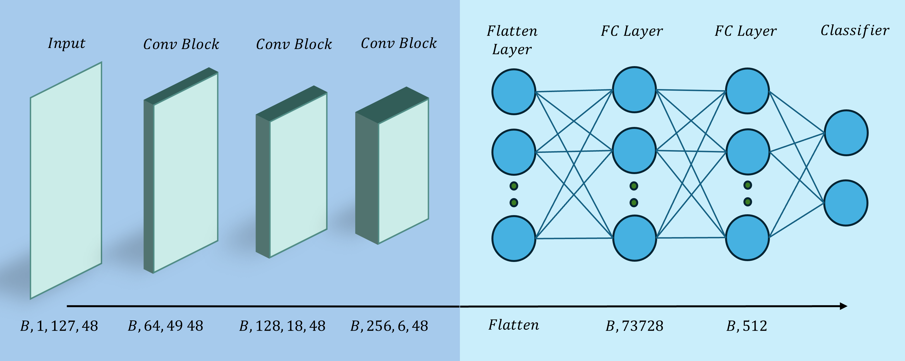

# A Novel Approach for the Early Identification of Genetic Risk Factors for Alzheimer’s Disease Using EEG and Psychometric Data

This repository contains the official implementation for the manuscript **“A Novel Approach for the Early Identification of Genetic Risk Factors for Alzheimer’s Disease Using EEG and Psychometric Data.”**  
Full citation information will be added upon acceptance of the manuscript.

---

## Repository Structure

    ├── code/        # All scripts used in the analysis and modeling pipeline
    ├── data/        # Extracted PSD and HFD features for the first 10 subjects
    ├── assets/      # Figures used in the manuscript
    └── README.md

### `code/`

This folder includes all scripts used throughout the study, covering:

- EEG preprocessing
- PSD and HFD feature extraction
- Integration of psychometric data
- Machine learning model training and evaluation
- Ablation experiments
- Statistical analysis workflows
- Permutation test

### `data/`

This folder contains extracted **Power Spectral Density (PSD)** and **Higuchi Fractal Dimension (HFD)** features for the first 10 subjects.

Raw EEG recordings are available at:  
https://openneuro.org/datasets/ds004796/versions/1.0.0

---

### Model Architecture

---

## HFD Feature Contribution

The computation of **Higuchi Fractal Dimension (HFD)** in this work uses the implementation from:

**Inuritdino — Higuchi Fractal Dimension**  
https://github.com/inuritdino/HiguchiFractalDimension

---

## Citation

The official citation for this paper and repository will be added here after journal acceptance.  
A full BibTeX entry will be provided once publication details are available.
